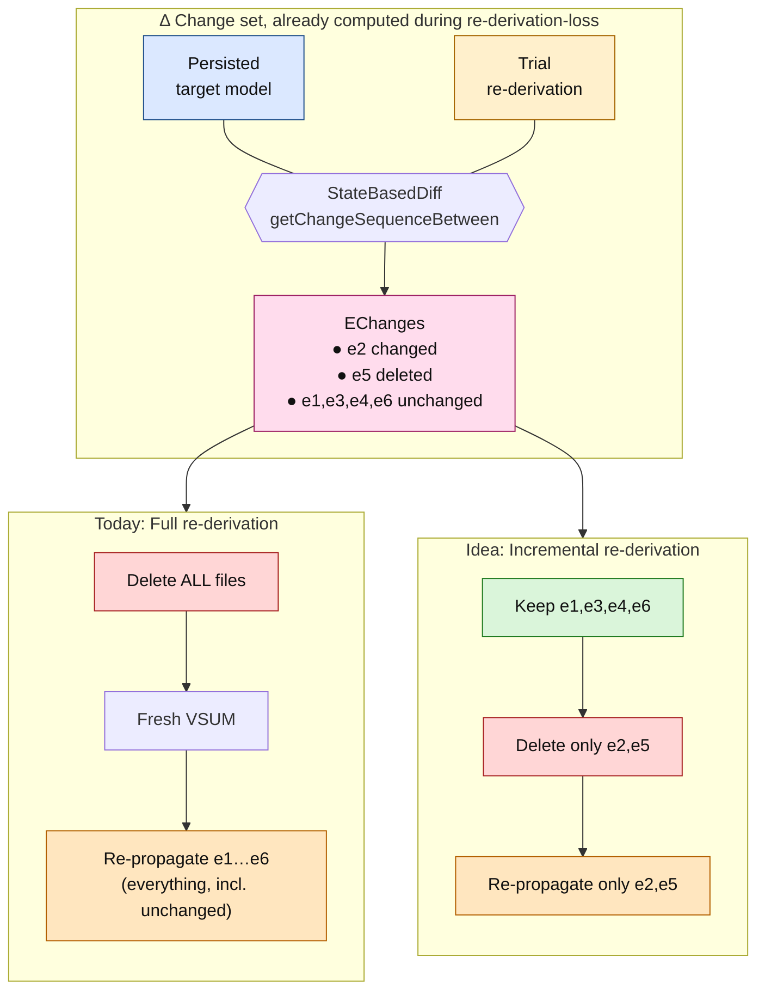

```mermaid
flowchart TB
    subgraph DIFF["Δ Change set, already computed during re-derivation-loss"]
        direction LR
        PERS["Persisted<br/>target model"]:::pers --- CMP{{"StateBasedDiff<br/>getChangeSequenceBetween"}}
        TRIAL["Trial<br/>re-derivation"]:::trial --- CMP
        CMP --> DELTA["EChanges<br/>● e2 changed<br/>● e5 deleted<br/>● e1,e3,e4,e6 unchanged"]:::delta
    end

    DELTA --> FULL
    DELTA --> INC

    subgraph FULL["Today: Full re-derivation"]
        direction TB
        F1["Delete ALL files"]:::del --> F2["Fresh VSUM"] --> F3["Re-propagate e1…e6<br/>(everything, incl. unchanged)"]:::red
    end

    subgraph INC["Idea: Incremental re-derivation"]
        direction TB
        I1["Keep e1,e3,e4,e6"]:::keep --> I2["Delete only e2,e5"]:::del --> I3["Re-propagate only e2,e5"]:::red
    end

    classDef pers fill:#dbe8ff,stroke:#1f4f8a,color:#111111;
    classDef trial fill:#fff0cc,stroke:#a56500,color:#111111;
    classDef delta fill:#ffdced,stroke:#9c1f63,color:#111111;
    classDef del fill:#ffd6d6,stroke:#a61f1f,color:#111111;
    classDef keep fill:#daf5da,stroke:#1f7a1f,color:#111111;
    classDef red fill:#ffe6bf,stroke:#b35f00,color:#111111;
```
