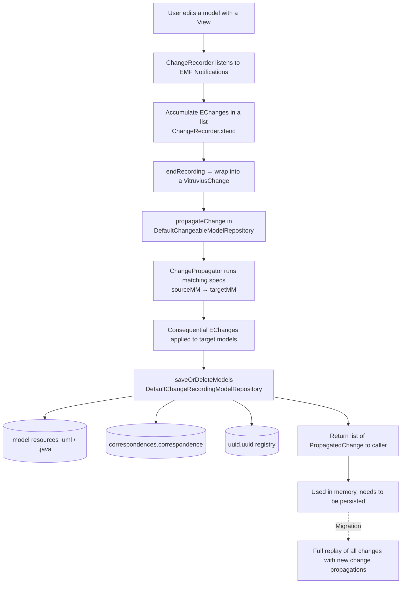

```mermaid
flowchart TD
      U[User edits a model with a View] --> R[ChangeRecorder listens to EMF Notifications]
      R --> L["Accumulate EChanges in a list<br/>ChangeRecorder.xtend"]
      L --> E["endRecording → wrap into a VitruviusChange"]
      E --> P["propagateChange in<br/>DefaultChangeableModelRepository"]
      P --> CP["ChangePropagator runs matching specs<br/>sourceMM → targetMM"]
      CP --> CC["Consequential EChanges applied to target models"]     
      CC --> SV["saveOrDeleteModels<br/>DefaultChangeRecordingModelRepository"]                  
      SV --> D1[(model resources .uml / .java)]                                   
      SV --> D2[(correspondences.correspondence)]                
      SV --> D3[(uuid.uuid registry)]                    
      SV --> RET["Return list of PropagatedChange to caller"]      
      RET --> DISC["Used in memory, needs to be persisted"]
      DISC -.Migration.-> HIST["Full replay of all changes with new change propagations"]
```