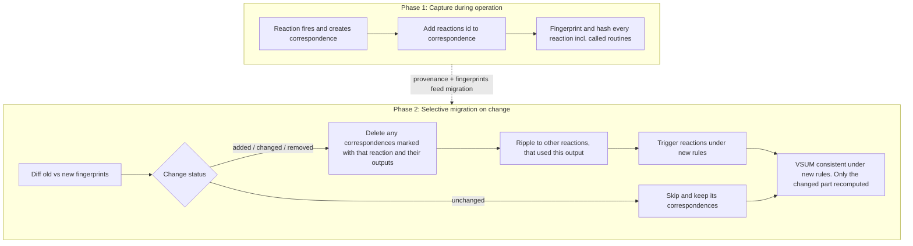

```mermaid
flowchart TD
    subgraph A["Phase 1: Capture during operation"]
        A1["Reaction fires and creates correspondence"]
        A1 --> A2["Add reactions id to correspondence"]
        A2 --> A3["Fingerprint and hash every reaction incl. called routines"]
    end                                                             
      subgraph B["Phase 2: Selective migration on change"]
          B1["Diff old vs new fingerprints"]
          B1 --> B2{"Change status"}
          B2 -->|unchanged| B3["Skip and keep its correspondences"]
          B2 -->|"added / changed / removed"| B4["Delete any correspondences marked with that reaction and their outputs"]
          B4 --> B6["Ripple to other reactions, that used this output"]
          B6 --> B5["Trigger reactions under new rules"]
          B5 --> B7["VSUM consistent under new rules. Only the changed part recomputed"]         
          B3 --> B7            
      end

      A -. "provenance + fingerprints feed migration" .-> B
```